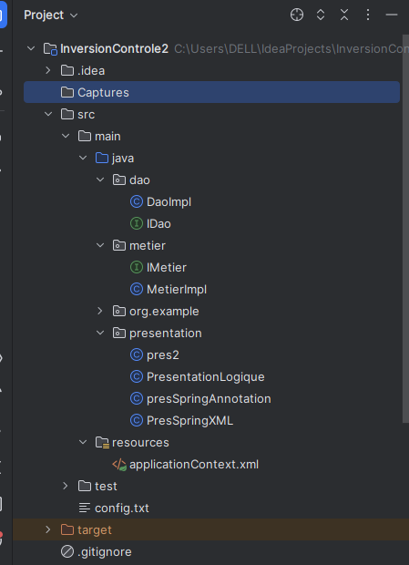
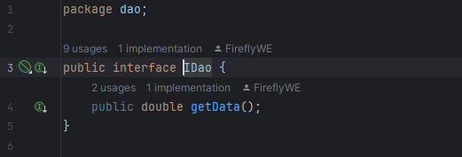
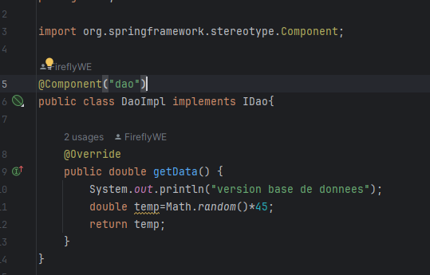
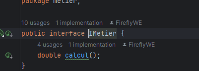
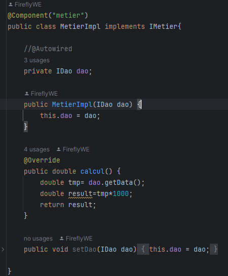
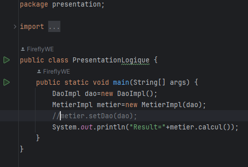
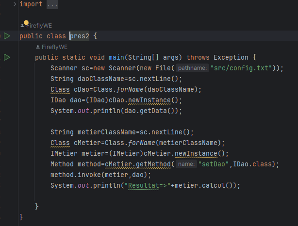
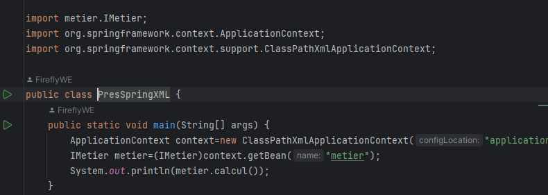
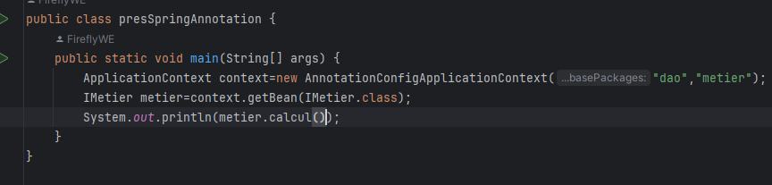

<h3>Compte Rendu réalisée par wissal elkhettab G3</h3>
<h4>Objectif:<h4>

L'objectif de ce TP et de comprendre le concept du l'inversion du controle et l'injection
des dépendances en rendant l'application fermée à la modification et ouverte à l'extension.

<h4>Les types de l'injection</h4>

1/Injection statique: en utilisant <i>new</i>

2/Injection dynamique: en utilisant un fichier txt de configuration

3/Injection en utilisant Spring: <i>Version XML et Version Annotation</i>

<h4><i>Architecture du projet</i></h4>

<h4><i>Interface IDao</i></h4>

<h4><i>Implémentation IDao</i></h4>

<h4><i>Interface IMetier</i></h4>

<h4><i>Implémentation IMetier</i></h4>

<h4><i>Injection statique</i></h4>

<h4><i>Injection dynamique</i></h4>

<h4><i>Version XML</i></h4>

<h4><i>Version Annotation</i></h4>
